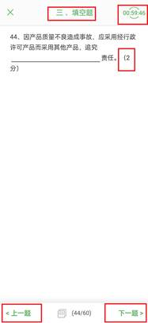
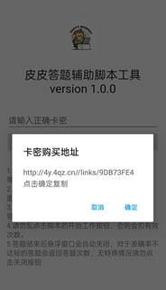
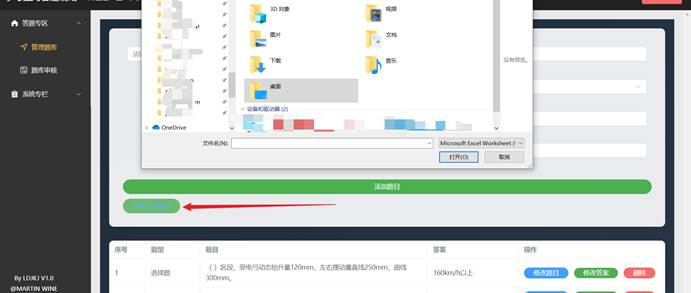

## 免责说明

本开源脚本用作学习交流，未经作者授权，不可用于商用。因擅自违法违规使用脚本出现的一切风险均与作者无关。学习交流QQ:61437327

## 一、脚本概述

### 1.软件介绍

本脚本是一款基于安卓手机自动答题脚本，管理员只需要补充好题目，用户购买卡密进行登录，开启窗口脚本，进入到答题界面便可实现单项选择题，判断题，填空题的自动答题功能。

### 2.当前版本及功能

**版本号：V1.0.7**

| 序号 | 身份               | 功能                                     | 备注                       |
| ---- | ------------------ | ---------------------------------------- | -------------------------- |
| 01   | 用户               | 自动答题                                 | 单项选择题，填空题，判断题 |
| 02   | 公告查看           |                                          |                            |
| 03   | 卡密登录           |                                          |                            |
| 04   | 卡密信息查看       |                                          |                            |
| 05   | 准确率验证         |                                          |                            |
| 06   | 卡密免扣次数机制   |                                          |                            |
| 07   | 题库中无题的则收录 |                                          |                            |
| 08   | 管理员             | 登录                                     |                            |
| 09   | 题库管理           | 增加（单个、批量），删除，修改，查询筛选 |                            |
| 10   | 新题管理           | 补充答案，修改题库，加入知识库，删除     |                            |
| 11   | 卡密管理           | 批量生成，查看状态，修改状态，删除       |                            |
| 12   | 公告管理           | 公告发布，删除，更新                     |                            |

### 3.软件适用类型

单项选题，判断题，填空题，并且题目前有题号，题目结尾有如“（ 分）”样式等，如图1红框内的特征点。

## 二、用户端

### 1、使用流程

(1)打开皮皮答题APP

（2）打开无障碍模式

（3）进入首页弹出公告，点击“确认”复制公告内容，点击“取消”则关闭公告。

（4）输入卡密，点击“确定”进行登录完成

（5）等完成后进入页面，可查看当前的卡密信息，点击“开始工作”可弹出“自动答题的悬浮窗界面”。

（6）将软件挂到后台，打开答题的软件应用，点击“开始/暂停识别答题”即可开始工作，初代版本，默认答题速度，2s每个，不具有自动交卷的功能。

### 2、问题或注意

（1）答题过程中请勿点击弹窗“关闭”，直接关闭后则所扣点数不返还，如果答题到最后一题后悬浮窗自动关闭，若未作答数量到达10%，则返还相应所扣点数。

（2）答题的悬浮窗请一定放置在界面的空白处，请勿遮挡题目与“下一题”字样。

（3）如若点击“开始工作”后出现“已开启悬浮窗，请勿重复”字样，则请关闭软件，清理下后台重新打开。

## 三、电脑网页管理端

### 1.使用流程

（1）进入后台输入账号密码登录，点击登录进入主页面。

（3）单个上传题目

（4）批量上传题目：点击“批量上传题目”按钮，导入按模板规定的题目。

（5）筛选题目

（6）题库管理，支持题库分页产看，删除，修改功能

（7）对于答题过程中，未发现的题库，则会自动收录到题库当中，可以在题库审核中进行审核。可修改，修订答案，加入知识库，删除功能。

（8）可进行卡密的管理，支持单个、批量生成卡密，支持修改卡密状态，支持删除卡密。

（9）支持公告的发布于管理

### 创作不易，给一杯咖啡~~您的支持会让我有更多创造的动力！！！

